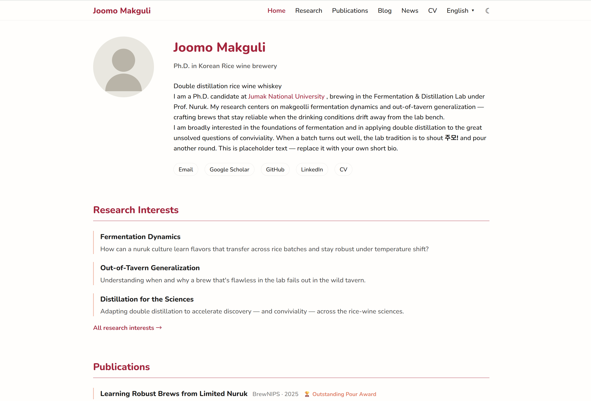
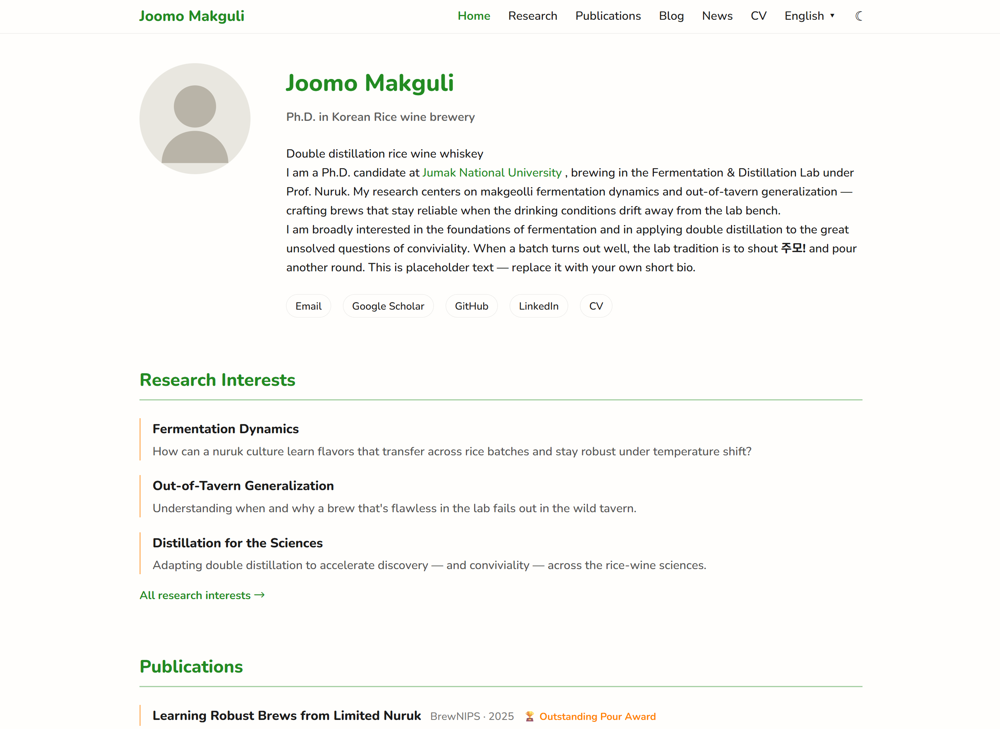
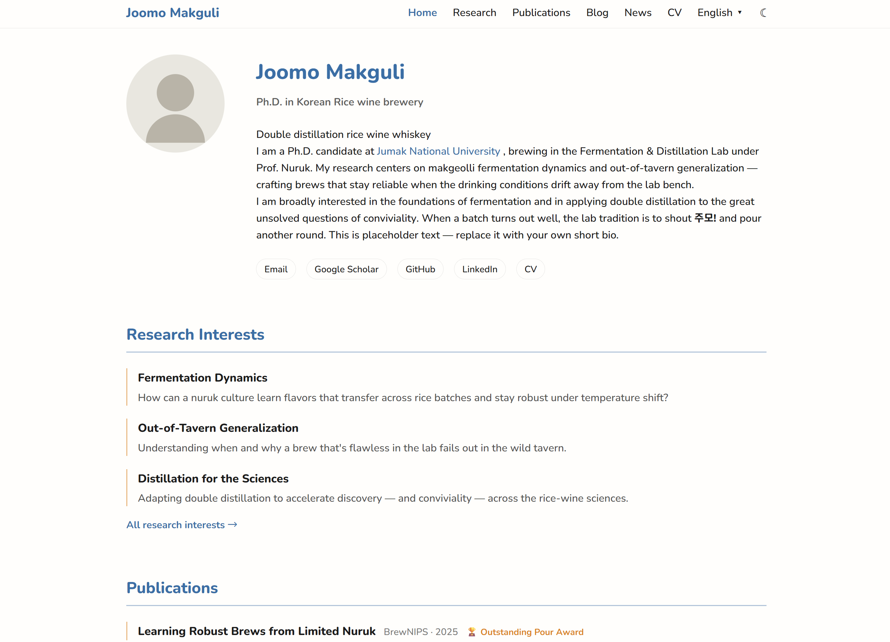
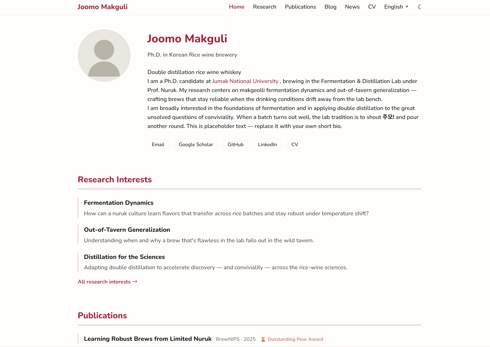
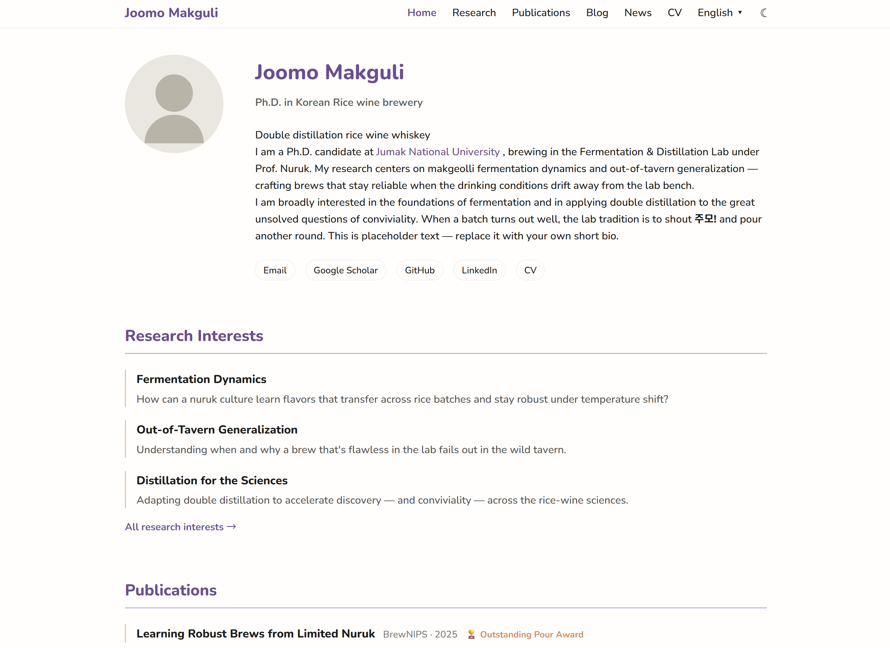
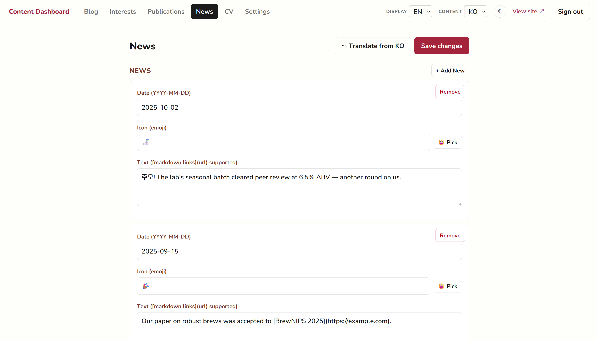

# Academic Portfolio: a No-Code Hugo template for researchers

**English** · [한국어](README.ko.md)

A clean, professional home for your academic life - your bio, publications, research
interests, news, CV, and a blog, all in one place. You add your own content through a
simple editor in your browser, with no code to write and nothing technical to learn,
and put it online for free. It comes ready for more than one language - English and
Korean to start, each shown with equal care - and looks right on phones and laptops
alike. The quiet, paper-like design keeps the attention on your work, not on the
website.

**[▶ Live demo](https://2ood.github.io/hugo-academic-portfolio/)** &nbsp;·&nbsp;
MIT-licensed &nbsp;·&nbsp; static + free to host on GitHub Pages


---

## Why this template

- **Zero Coding Maintenance: Owner-configurable without touching templates.** Identity, social links, a
  named color palette, and which sections appear all live in one YAML file -
  editable by hand or from the dashboard. No need to learn frontend whatsoever.
- **Native Mobile Support : Responsive layout.** You can read the contents beautifully on small viewports. 
- **Multilingual out of the box.** English + a Korean demo, a header language
  dropdown, per-language content and UI strings. Add or drop languages in config.
- **Free to host.** Minified static output to GitHub Pages via GitHub Actions on
  every push to `main`.
- **A browser content dashboard.** Schema-driven editors for publications, news,
  CV, and research interests, plus a split Markdown editor with paste-to-upload
  images - staged and flushed as clean, single commits to your repo.
- **Dependency-light.** The build is the Hugo binary alone - no Node, no bundler,
  no PostCSS. The optional content editor is a single zero-dependency Python file.
- **Light/dark + named palettes.** A visitor toggle remembered per browser, no
  flash on load, respecting the OS preference; four palettes via CSS custom properties.


## What's inside

| Section | What it shows |
|---|---|
| **Home** | Profile, bio, tagline, and a *Selected Publications* shortlist |
| **Research Interests** | Themed interests, each with a summary and a dedicated page that auto-lists matching publications |
| **Publications** | Filterable list (Conference / Workshop / Journal / Preprint) with paper, code, data, and project links, plus awards |
| **News** | Dated, emoji-tagged announcements |
| **CV** | Education, awards, academic service, and teaching - plus a downloadable PDF |
| **Blog** | Markdown posts with tags, drafts, per-language siblings, and an image lightbox |

Every section can be toggled off in config, and each is bilingual-ready.

## Quickstart (≈5 minutes)

**Prerequisites:** [Hugo Extended](https://gohugo.io/installation/) ≥ 0.146
(content adapters + native Sass). Python 3 only if you want the browser dashboard.
Theming uses CSS relative-color syntax, so visitors need a 2023+ browser
(Chrome 119, Safari 16.4, Firefox 128).

1. **Get the template** - click *Use this template* on GitHub, or clone it:
   ```bash
   git clone <your-repo-url> && cd <repo>
   ```
2. **Personalize** - one prompt rewrites `hugo.toml` + `params.yaml` for you
   (name, affiliation, social links, palette, Pages URL). No dependencies, and your
   comments and language list are preserved:
   ```bash
   python init.py
   ```
   Prefer to edit by hand? Skip it and see [Make it yours](#make-it-yours).
3. **Preview** - live-reloads as you edit:
   ```bash
   hugo server        # http://localhost:1313/
   ```
4. **Add your content** - edit the Markdown/YAML directly, or use the dashboard:
   ```bash
   python cms-server.py   # then open http://localhost:8787/
   ```
   Swap the demo bio in `content/_index.md`, the data in `data/en/*.yml`,
   `static/images/profile.svg`, and `static/cv.pdf`.
5. **Deploy** - set `baseURL` to your Pages URL, then push. GitHub Actions builds
   with Hugo and publishes automatically:
   ```bash
   git push origin main
   ```

Result: a live academic site at `https://<you>.github.io/<repo>/`.

> 📖 Want the hand-held version? **[QUICKSTART.md](QUICKSTART.md)** has full
> walkthroughs - first deploy, writing a post, editing publications/news/CV,
> adding a language, configuring from the dashboard, and the common gotchas
> (like *deploy with GitHub Actions, not a branch*).

## Make it yours

For a hand-edited setup, or to go beyond what `init.py` covers:

1. **Identity & structure** - in `config/_default/hugo.toml` set `baseURL`,
   `title` (your name), and the language list. In `config/_default/params.yaml`
   set `description`, `tagline`, social links, `palette`, and the `sections` toggles.
2. **Content** - replace the placeholder data in `data/<lang>/*.yml`
   (publications, news, cv, research_interests), the bio in `content/_index.md`,
   and the demo posts in `content/blog/`. Swap `static/images/profile.svg` and
   `static/cv.pdf` for your own.
3. **Preview** with `hugo server`, then push to `main` to deploy.

### Configuration reference (`config/_default/params.yaml`)

| Key | Purpose |
|---|---|
| `description` | Affiliation line shown under your name |
| `tagline` | One-line summary on the home page |
| `faviconEmoji` | Emoji used as the favicon (default 🌲) |
| `profileImage` | Path under `static/` to your profile image |
| `email`, `googleScholar`, `github`, `linkedin` | Social links |
| `cvPdf` | Path under `static/` to your CV PDF |
| `palette` | `forest` · `slate` · `crimson` · `plum` (see `assets/scss/_theme.scss`) |
| `sections` | Per-section booleans: `research`, `publications`, `blog`, `news`, `cv` |

Per-language overrides for `description`/`tagline` go in
`config/_default/hugo.toml` under `[languages.<lang>.params]`.

### Adding a language

1. Add a `[languages.<lang>]` block in `config/_default/hugo.toml`.
2. Copy `i18n/en.toml` to `i18n/<lang>.toml` and translate the values.
3. Add `data/<lang>/*.yml` (copy from `data/en/`; keep `title` keys identical so
   slugs and cross-links stay stable, then translate the prose).
4. Add `<name>.<lang>.md` content siblings (e.g. `_index.<lang>.md`) and a
   `_content.<lang>.gotmpl` for the publications and research-interests sections.
5. Update `LANGS` in `static/admin/admin.js` so the dashboard can edit the new
   language's content.

### Colors & theme

Palettes are defined in `assets/scss/_theme.scss` as sets of CSS custom properties.
The owner-selected `palette` sets `data-palette` on `<html>`; the visitor's light/dark
choice sets `data-theme`. Add a palette by adding a `[data-palette="name"]` block and
listing the name in `PALETTES` in `static/admin/admin.js`.

Predefined options are :

|Forest|Slate|
|-----|-----|
|  |  |

|Crimson|Plum|
|-----|-----|
|  |  |

## The content dashboard (`/admin/`)



Two ways to edit content:

1. **Directly** - edit the Markdown/YAML and commit.
2. **Dashboard** - a zero-dependency Python backend that serves the editor and
   commits to your **local** git repo (push in bulk when ready):

   ```bash
   python cms-server.py     # then open http://localhost:8787/
   ```

   Use the **content-language selector** (top right) to edit each language's data and
   posts. The **Settings** tab edits `config/_default/params.yaml` (palette, sections,
   social links). The local server only accepts loopback requests.

   Edits are **staged in the browser**, not committed one-by-one: each editor's Save
   button records your change, and a single **Commit (N)** button in the nav bar
   flushes the whole batch as **one** commit (it appears only when there are pending
   changes). The editor always reflects staged-but-uncommitted work, and you're warned
   before leaving or signing out with pending changes - keeping history clean.

   Each content editor has a **⤳ Translate from …** button that pulls the content
   from another language and loads a translation *into the editor you're in* (so
   you review it and save like any other edit - it never commits on its own),
   using the free, keyless [MyMemory](https://mymemory.translated.net) service
   (client-side; works locally and on Pages). It translates only prose - titles,
   authors, venues, URLs, and slugs stay fixed - protects markdown, and fills only
   *empty* fields so your hand-edits are never overwritten. Treat the output as a
   draft to review (conventional MT, not an LLM).

   The blog-post and research-interest editors split into a live-rendered preview
   next to the Markdown source (typography mirrors the real post page), plus an
   **Open preview** button for a full-page, non-interactive replica of the deployed
   look - real nav, footer, and layout - so you can check a draft before committing.

   When the dashboard is served from GitHub Pages instead, it falls back to committing
   through the GitHub API using a **fine-grained token** scoped to the repo
   (Contents: read/write). Click **Authorize with GitHub** on the login screen to open
   GitHub's token page pre-filled, then paste the token back. Owner/repo are detected
   from the Pages URL (override `OWNER`/`REPO` in `static/admin/admin.js` for custom
   domains). Use a short token expiration - the dashboard also self-expires the stored
   token after 2 days. The dashboard's palette, light/dark mode, and UI language are
   adjustable from its header.

## Deployment

Pushing to `main` triggers `.github/workflows/deploy.yml`, which builds with Hugo
Extended and publishes `public/` to GitHub Pages. Set `baseURL` in
`config/_default/hugo.toml` to your Pages URL first.

## Project layout

```
config/_default/  hugo.toml (structural) + params.yaml (owner-editable)
content/          Markdown pages + posts; data-driven sections via _content.<lang>.gotmpl
data/<lang>/      Per-language structured content (publications, news, cv, interests)
i18n/             UI string bundles (en.toml, ko.toml, …)
layouts/          Go templates - shell, per-section views, partials, render hooks
assets/scss/      main.scss entry, _variables.scss, _theme.scss tokens, per-component partials
assets/js/        main.js (fingerprinted at build for cache-busting)
static/           Images, cv.pdf, and the /admin dashboard
```

## Documentation

- [QUICKSTART.md](QUICKSTART.md) - step-by-step walkthroughs for the common tasks
- [CHANGELOG.md](CHANGELOG.md) - notable changes
- [ROADMAP.md](ROADMAP.md) - direction and ideas

## License

[MIT](LICENSE). If you build something with it, an attribution link back to the
template is appreciated but not required.
